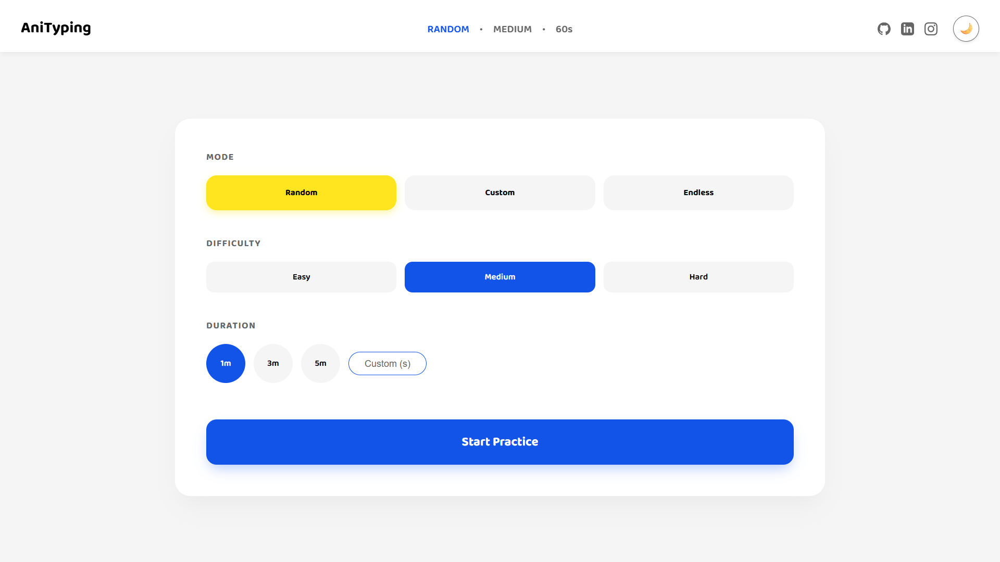
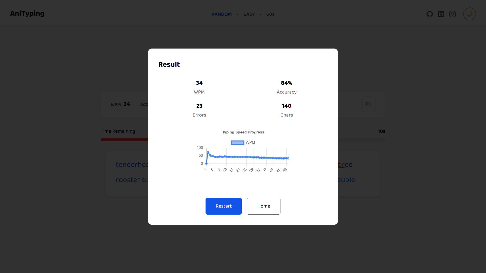

# 🏆 AniTyping | Master Touch Typing

[](https://anityping.vercel.app)

An elegant, modern, and feature-rich typing platform designed for performance and aesthetics, following a "Function follows Form" philosophy to create a tool that feels premium and professional.

**Note:** The source code for this project is private. This repository serves as a public showcase of the live application, its features, and the technologies used to build it.

---

## ✨ Key Features

* **Advanced Practice Modes**: Includes a dynamic Random Mode, Custom Key Practice to target specific muscle memory, and a high-stakes "perma-death" Endless Mode.
* **High-Fidelity Feedback**: Features live WPM & accuracy updates, a fully responsive visual keyboard that mirrors input in real-time, and intelligent auto-scrolling to eliminate distractions.
* **Data-Driven Insights**: Leverages performance charting to render WPM progress graphs and detailed statistical breakdowns at the end of every session.
* **Immersion & Aesthetics**: Utilizes procedurally generated "thock" and "click" sounds via the Web Audio API for zero latency, wrapped in a premium Glassmorphic UI with Light and Dark mode theming.

---

## 🛠️ Tech Stack

This project was built using a modern, performance-first tech stack:

* **Framework**: Next.js 15+ (App Router, Server Components)
* **Styling**: Vanilla CSS (Custom Design System, zero dependencies)
* **Audio**: Web Audio API (Procedural Sound)
* **Data Visualization**: Chart.js
* **State Management**: React Hooks (`useRef`, `useCallback`, `useMemo`) optimized for 60FPS typing

---

## 📸 Project Walkthrough

### 1. Home Page
Dynamic configurations allowing users to target specific keys, adjust difficulty parameters, or test their limits in Endless Mode.



### 2. The Typing Dashboard
A premium glassmorphic interface featuring a live WPM counter and a responsive visual keyboard that mirrors every keystroke in real-time.


### 3. Performance Analytics
After each session, users receive a professional-grade Chart.js graph tracking their speed stability and detailed accuracy metrics.


---

## 🧬 Core Logic

The application leverages a custom-built utility for text generation that balances word complexity and sentence structure based on local JSON datasets containing **10,000+ entries**.

```javascript
// Example of the Gross WPM formula used:
const wpm = (totalCharacters / 5) / (timeInSeconds / 60);
```
---

## 🚀 Project Status

This project is **live and operational**. It is designed as a professional-grade tool to help users improve their typing speed and muscle memory.

---

## 👤 About Me

I'm **Animesh Gupta**, a Computer Science student at **IIIT Bhopal**, pursuing my **B.Tech in CSE (Data Science)** (2025–2029). I enjoy building real-world web projects that combine clean UI with practical functionality.

---

## 🔒 License & Usage

**All rights reserved.**
This project is a personal portfolio piece. Copying, modifying, or redistributing the code or design is strictly prohibited without explicit written permission.
You are welcome to view the project for inspiration or review it for professional/interview purposes, but using it in your own projects or sharing it as your own work is not permitted.

**AniTyping © 2026 | Made with ❤️ by Animesh Gupta**
